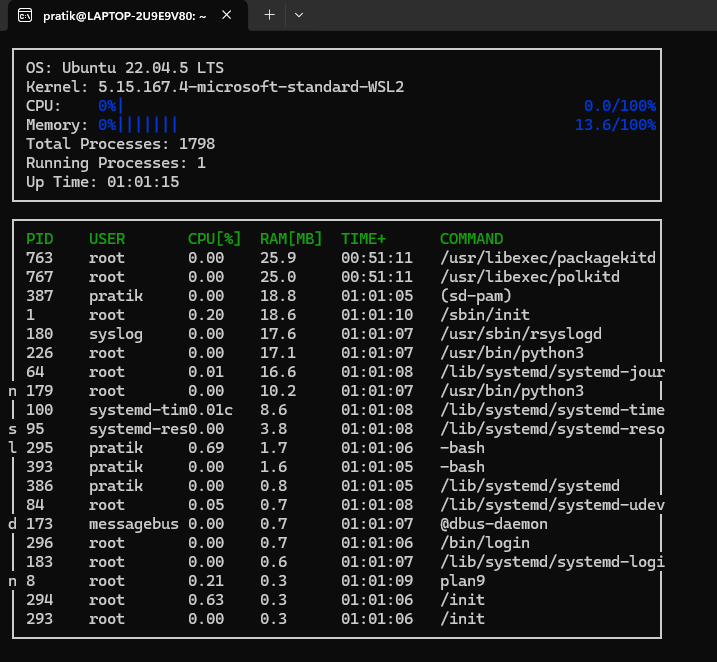

# C++ Linux System Monitor - [DEMO](https://www.linkedin.com/posts/utkarshchaurasia_linux-cpp-oop-activity-6670235011100278784-6r2V)

## About
The system monitor shows you what’s happening the computer: processes, id, CPU and memory usage. In this project, I wrote object-oriented C++ to build a Linux system monitor similar to the widely used htop application.

## ncurses
[ncurses](https://www.gnu.org/software/ncurses/) is a library that facilitates text-based graphical output in the terminal. This project relies on ncurses for display output.

Install ncurses within your own Linux environment to run this project: `sudo apt install libncurses5-dev libncursesw5-dev`

## Make
This project uses [Make](https://www.gnu.org/software/make/). The Makefile has four targets:
* `build` compiles the source code and generates an executable
* `format` applies [ClangFormat](https://clang.llvm.org/docs/ClangFormat.html) to style the source code
* `debug` compiles the source code and generates an executable, including debugging symbols
* `clean` deletes the `build/` directory, including all of the build artifacts

## Instructions

1. Clone the project repository: `git clone git@github.com:UtkarshChaurasia/Linux-System-Monitor.git`

2. Build the project: `make build`

3. Run the resulting executable: `./build/monitor`
